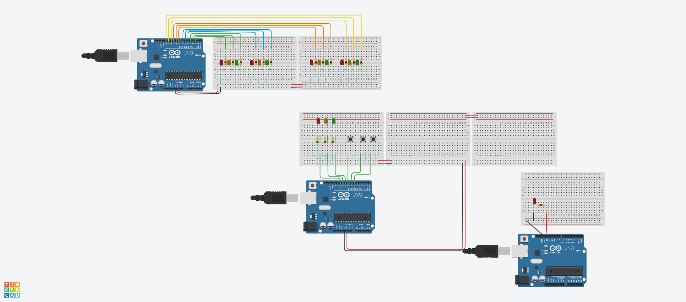

🚦 Semáforo com Arduino (Treino de Automação)
Este é um projeto prático e simples de automação residencial/eletrônica desenvolvido para fixar os conceitos básicos de controle de portas digitais, temporização e uso de protoboard com o ecossistema Arduino.

O projeto simula o ciclo de funcionamento de um semáforo de trânsito comum utilizando três LEDs (Vermelho, Amarelo e Verde) que alternam seus estados baseados em intervalos de tempo definidos via código.

🛠️ Componentes Utilizados
1x Placa Arduino (Uno, Nano ou Mega)

1x Protoboard (Matriz de contatos)

3x LEDs (1 Vermelho, 1 Amarelo, 1 Verde)

3x Resistores (Recomendado de 220Ω a 330Ω para proteger os LEDs)

Cabos Jumper (Macho x Macho)

🔌 Esquema de Ligação (Hardware)
Abaixo estão os pinos digitais configurados e utilizados no projeto:

Pino Digital 9: LED Vermelho (Pare)

Pino Digital 10: LED Amarelo (Atenção)

Pino Digital 11: LED Verde (Siga)

GND (Terra): Conectado ao catodo (pino mais curto) de todos os LEDs através dos resistores.

💻 Código-Fonte (SEMAFORO-ARDUINO.ino)
O código configura os pinos como saídas e gerencia o tempo de acendimento de cada luz utilizando a função delay(). Há um intervalo de 1 segundo (1000ms) de "janela de segurança" com todas as luzes apagadas entre as transições.

C++
void setup() {
  // Configura os pinos digitais como saídas
  pinMode(9, OUTPUT);
  pinMode(10, OUTPUT);
  pinMode(11, OUTPUT);
}

void loop() {
  // 🔴 VERMELHO: Acende por 5 segundos
  digitalWrite(9, HIGH);
  delay(5000);
  digitalWrite(9, LOW);
  delay(1000); // Intervalo de segurança

  // 🟡 AMARELO: Acende por 1 segundo
  digitalWrite(10, HIGH);
  delay(1000);
  digitalWrite(10, LOW);
  delay(1000); // Intervalo de segurança

  // 🟢 VERDE: Acende por 3 segundos
  digitalWrite(11, HIGH);
  delay(3000);
  digitalWrite(11, LOW);
  delay(1000); // Intervalo de segurança
}
🚀 Próximos Passos (Ideias de Evolução)
Para continuar treinando a lógica de automação neste mesmo circuito, as próximas implementações sugeridas são:

Adicionar um botão físico para simular o "Botão de Pedestre" (interrompendo o ciclo para abrir o sinal vermelho).

Adicionar um Buzzer (sinal sonoro) para auxiliar pedestres com deficiência visual quando o sinal estiver verde para travessia.

Otimizar o código utilizando a função millis() para evitar o travamento do fluxo gerado pelo delay().

Este projeto faz parte dos meus estudos de automação de sistemas e eletrônica com microcontroladores.
