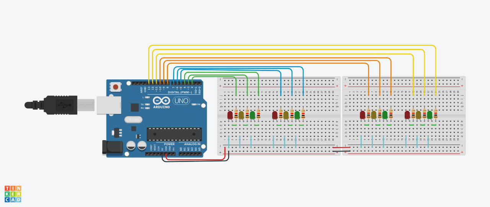

# 🚦 Semáforo Quádruplo com Arduino (Treino de Automação Avançado)

Este projeto simula o ciclo completo de sincronização de um **cruzamento viário de quatro vias** utilizando o ecossistema Arduino. Ele expande o conceito de semáforo simples para um sistema de automação intertravado, onde dois pares de semáforos operam de forma coordenada para garantir o fluxo seguro de veículos em duas avenidas cruzadas.

O código gerencia o acendimento simultâneo dos sinais opostos (Via A e Via B), alternando entre os estados de Siga (Verde), Atenção (Amarelo) e Pare (Vermelho) sem deixar brechas de segurança.




---

## 🛠️ Componentes Utilizados

* 1x Placa Arduino (Uno, Nano ou Mega)
* 1x Protoboard grande (ou matrizes interconectadas)
* 4x LEDs Vermelhos
* 4x LEDs Amarelos
* 4x LEDs Verdes
* 12x Resistores (Recomendado de 220Ω a 330Ω para proteção dos LEDs)
* Cabos Jumper (Macho x Macho)

---

## 🔌 Esquema de Ligação (Hardware)

Os componentes estão mapeados em grupos que correspondem a cada um dos quatro semáforos instalados no cruzamento:

### **VIA A (Semáforos 1 e 3 - Fluxo Norte/Sul)**

* **Semáforo 1:** * Pino Digital 2: LED Vermelho
* Pino Digital 3: LED Amarelo
* Pino Digital 4: LED Verde


* **Semáforo 3:** * Pino Digital 8: LED Vermelho
* Pino Digital 9: LED Amarelo
* Pino Digital 10: LED Verde


### **VIA B (Semáforos 2 e 4 - Fluxo Leste/Oeste)**

* **Semáforo 2:** * Pino Digital 5: LED Vermelho
* Pino Digital 6: LED Amarelo
* Pino Digital 7: LED Verde


* **Semáforo 4:** * Pino Digital 11: LED Vermelho
* Pino Digital 12: LED Amarelo
* Pino Digital 13: LED Verde


> ⚠️ **Nota de Conexão:** O GND (Terra) do Arduino deve ser conectado ao catodo (pino mais curto) de todos os 12 LEDs utilizando os resistores de proteção em série.

---

## 💻 Código-Fonte (SEMAFORO_QUADRUPLO.ino)

O código abaixo inicializa todas as 12 portas digitais como saídas e gerencia as quatro fases do cruzamento viário de forma sequencial e intertravada.

```cpp
// --- SEMÁFOROS DA VIA A (1 e 3) ---
int vermelho  = 2;
int amarelo   = 3;
int verde     = 4;
int vermelho3 = 8;
int amarelo3  = 9;
int verde3    = 10;

// --- SEMÁFOROS DA VIA B (2 e 4) ---
int vermelho2 = 5;
int amarelo2  = 6;
int verde2    = 7;
int vermelho4 = 11;
int amarelo4  = 12;
int verde4    = 13;

void setup() {
  // Configuração dos pinos do Semáforo 1
  pinMode(vermelho, OUTPUT);
  pinMode(amarelo, OUTPUT);
  pinMode(verde, OUTPUT);
  
  // Configuração dos pinos do Semáforo 2
  pinMode(vermelho2, OUTPUT);
  pinMode(amarelo2, OUTPUT);
  pinMode(verde2, OUTPUT);
  
  // Configuração dos pinos do Semáforo 3
  pinMode(vermelho3, OUTPUT);
  pinMode(amarelo3, OUTPUT);
  pinMode(verde3, OUTPUT);
  
  // Configuração dos pinos do Semáforo 4
  pinMode(vermelho4, OUTPUT);
  pinMode(amarelo4, OUTPUT);
  pinMode(verde4, OUTPUT);
}

void loop() {
  // === ESTÁGIO 1: Via A Aberta (1 e 3) | Via B Fechada (2 e 4) ===
  digitalWrite(verde, HIGH);
  digitalWrite(verde3, HIGH);
  digitalWrite(vermelho2, HIGH);
  digitalWrite(vermelho4, HIGH);
  delay(5000); 

  // === ESTÁGIO 2: Via A em Atenção (1 e 3 Amarelo) | Via B continua Fechada ===
  digitalWrite(verde, LOW);
  digitalWrite(verde3, LOW);
  digitalWrite(amarelo, HIGH);
  digitalWrite(amarelo3, HIGH);
  delay(2000); 
  
  // Desliga os amarelos da Via A para fechar o fluxo de vez
  digitalWrite(amarelo, LOW);
  digitalWrite(amarelo3, LOW);

  // === ESTÁGIO 3: Via A Fechada (1 e 3) | Via B Aberta (2 e 4) ===
  digitalWrite(vermelho, HIGH);
  digitalWrite(vermelho3, HIGH);
  digitalWrite(vermelho2, LOW); // Libera o sinal vermelho anterior da Via B
  digitalWrite(vermelho4, LOW); 
  
  digitalWrite(verde2, HIGH);
  digitalWrite(verde4, HIGH);
  delay(5000); 

  // === ESTÁGIO 4: Via A continua Fechada | Via B em Atenção (2 e 4 Amarelo) ===
  digitalWrite(verde2, LOW);
  digitalWrite(verde4, LOW);
  digitalWrite(amarelo2, HIGH);
  digitalWrite(amarelo4, HIGH);
  delay(2000); 

  // Limpa os estados de retenção antes de reiniciar o loop principal
  digitalWrite(vermelho, LOW);
  digitalWrite(vermelho3, LOW);
  digitalWrite(amarelo2, LOW);
  digitalWrite(amarelo4, LOW);
}

```

---

## 📈 Lógica de Funcionamento (Ciclo do Sistema)

1. **Fase Inicial:** Os semáforos 1 e 3 ficam verdes por 5 segundos. Simultaneamente, os semáforos 2 e 4 permanecem fechados em vermelho.
2. **Transição A:** O sinal verde da Via A cai, acionando o amarelo de atenção por 2 segundos. A Via B continua retida em vermelho absoluto.
3. **Inversão de Fluxo:** A Via A fecha completamente (Vermelho). No exato instante seguinte, a Via B abre (Verde) e permanece ativa por 5 segundos.
4. **Transição B:** O sinal verde da Via B cai, acionando seu respectivo amarelo por 2 segundos. A Via A se mantém fechada. Após isso, o ciclo recomeça.

---

## 🚀 Próximos Passos (Ideias de Evolução)

Para expandir a complexidade deste mesmo cruzamento viário, as seguintes implementações são recomendadas:

* **Botoeiras de Pedestre Interativas:** Instalar botões para interromper as janelas de tempo de 5 segundos se houver demanda de travessia nas faixas de pedestre.
* **Modo Noturno Automático:** Implementar um sensor LDR (sensor de luz) para detectar a ausência de luz e fazer com que todos os semáforos amarelos pisquem intermitentemente, simulando a operação real de madrugada.
* **Refatoração com `millis()`:** Eliminar a função `delay()` estruturando o tempo através de contadores baseados em clock interno para permitir detecção instantânea de periféricos.

---

*Este projeto faz parte dos meus estudos avançados de automação de sistemas, lógica computacional intertravada e eletrônica com microcontroladores.*
